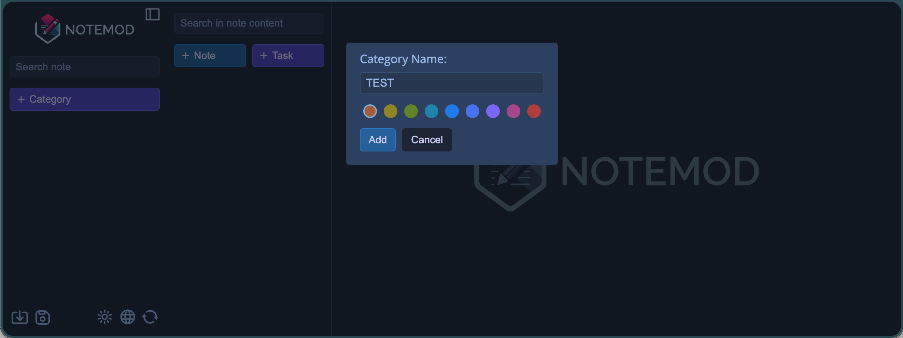
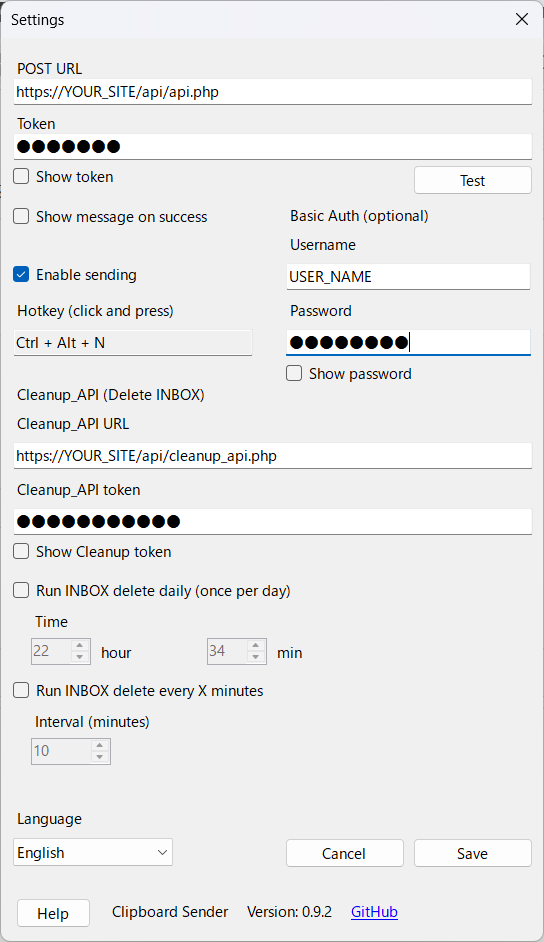

# notemod-selfhosted

A self-hosted, API-driven fork of **[Notemod](https://github.com/orayemre/Notemod)** (MIT License) designed to run on simple shared hosting (no DB required) and to integrate with external tools (iPhone Shortcuts, Windows apps, scripts, etc.).　The database is not required, so it’s ready to use as soon as you upload it to the web server.

Upload the file to the server, and you can use it simply by writing the secret key and token into two config files.
The shared servers that have been tested and confirmed to work are InfinityFree, Xserver, SAKURA Internet, and XREA.
Tested with PHP version 8.3.21.


> **Single source of truth:** `notemod-data/data.json`

---

## Purpose of Development

To make clipboard synchronization between an iPhone and a Windows PC as seamless as possible—close to the level of comfort between an iPhone and a Mac.  
The goal is to achieve this **without relying on any external services**.
By setting up your own server, you can further reduce dependence on external services.

Text copied on a Windows PC is instantly sent to Notemod-selfhosted — **implemented by the Windows app ClipboardSender**.  
When a shortcut is run on the iPhone, that text becomes available for pasting on the iPhone.

---

## Usage

### 1. Deploy to your server
Upload the entire repository into your public web directory (e.g. `public_html/`).

> Note: Keep `config/` and `api/` at the same level as `index.php`.  
> If you change the directory structure, you must also update PHP paths accordingly.

### 2. Create configuration files (Important)

#### Common settings
Rename `config/config.sample.php` to `config/config.php`, then configure:
- Replace `CHANGE_ME_SECRET` with a long random string (16+ characters recommended)
- Set `TIMEZONE` if needed

#### API settings
Rename `config/config.api.sample.php` to `config/config.api.php`, then configure:
- Replace `CHANGE_ME_EXPECTED_TOKEN` with your token
- Replace `CHANGE_ME_ADMIN_TOKEN` with a stronger token (recommended) used for cleanup operations

### 3. Generate SECRET / TOKEN values
You can use a password generator website, for example:
https://passwords-generator.org/

If you prefer not to rely on third-party sites, you can also generate values locally, e.g.:
- `openssl rand -hex 32`
- *The term "SECRET" is merely decorative and is planned to be discontinued in the future.*

### 4. First-time initialization (one time only)
Open your site in a browser to launch **Notemod-selfhosted**.  
Set the display language and create the first category.

This operation will automatically generate the following if they do not already exist:
- Data files under `notemod-data/` (e.g. `data.json`)
- `notemod-data/.htaccess` (blocks direct access)
- (optional, depending on config) `logs/` and `logs/.htaccess`
- `api/.htaccess` (By default, access to the API is allowed, but BASIC authentication is strongly recommended.)



### Be sure to set up Basic authentication (important).

Notemod-selfhosted stores personal notes and API tokens.  
Even if you use `.htaccess` and `robots.txt`, you should **strongly enable Basic Authentication** to protect your deployment.

**Why this is important**
- `robots.txt` does **not** protect your site (it only requests crawlers not to index)
- API endpoints (`/api/`) are reachable from the internet if your server is public
- Tokens may be brute-forced if exposed long-term
- Basic Auth adds an extra security layer before your PHP token checks

**Recommended scope**
- Protect the entire site (best)
  - or at minimum protect:
    - `/api/`
    - `/notemod-data/`
    - `/config/` (should not be public, but protect anyway)

**Basic Auth and iPhone Shortcuts**
- iPhone Shortcuts supports Basic Authentication, so you can still call API endpoints safely.

### 5. How to use / Integrations
Detailed usage (API calls / iPhone Shortcuts / ClipboardSender integration, etc.) is explained in the links below.
- [StayHomeLab YouTube ch](https://www.youtube.com/@StayHomeLab)  
- [Website](https://stayhomelab.net/notemod-selfhosted)  
- [ClipboardSender](https://github.com/StayHomeLabNet/ClipboardSender)  

---

## What this project adds

- **Server-side sync endpoint** (`notemod_sync.php`)
  - Token auth
  - `save` / `load`
  - Initializes `data.json` with an initial snapshot when missing
  - Auto-creates protective `.htaccess` in:
    - `notemod-data/`
    - `config/`
  - Create a .htaccess file in the api folder if it doesn’t exist.
- **Write API** (`api/api.php`)
  - Adds notes into any category (auto-creates category if missing)
- **Read API** (`api/read_api.php`)
  - Read-only access
  - `latest_note` always excludes the **Logs** category
  - `pretty=2` returns *plain text* (HTML→line breaks) for Shortcuts / CLI usage
- **Cleanup API** (`api/cleanup_api.php`)　**Delete if not needed.**
  - Destructive delete-by-category (POST only)
  - `dry_run` support
  - Optional backup creation (configurable)
- **Access logger** (`logger.php`)
  - Optional file log to `/logs*/access-YYYY-MM.log`
  - Optional Notemod **Logs** category logging (monthly note)
  - Timezone from config
  - Auto-creates log folder + `.htaccess` when enabled
- **Added Copy / Paste buttons to the toolbar** (index.php)
  - Disabled the original copy & paste buttons (sag-tik version)
  - The custom Copy button copies the entire note content when nothing is selected
  - If text inside a note is selected, it copies only the selected range

---

## Requirements

- PHP 7.4+ recommended (works on many shared hosts)
- Web server: Apache (recommended) / compatible env
- Writable directories (by PHP):
  - `notemod-data/`
  - (optional) `logs/` or your configured log directory

---

## Directory layout (recommended)

```
public_html/
├─ index.php                 # Notemod UI
├─ logger.php                # access logging + Logs category logging
├─ notemod_sync.php           # sync endpoint (save/load)
├─ api/
│  ├─ api.php                # add note
│  ├─ read_api.php           # read API
│  └─ cleanup_api.php        # delete notes in a category (admin)
├─ notemod-data/
│  └─ data.json              # single data source
├─ config/
│  ├─ config.php             # secrets + common settings (DO NOT COMMIT)
│  └─ config.api.php         # API tokens + paths (DO NOT COMMIT)
└─ robots.txt                # Search engine indexing　(block all crawlers)
```

---

## Security notes (important)

- Keep `config/config.php` and `config/config.api.php` **out of Git**.
- `notemod_sync.php` auto-creates `.htaccess` in `config/` and `notemod-data/` if missing.
- Consider adding **Basic Auth** to `/api/` on shared hosting.

---

## Configuration

Create these files on the server (not committed):

### `config/config.php`

```php
<?php
// config/config.sample.php
// ------------------------------------------------------------
// Public sample (for publishing on GitHub)
// For actual operation, create config.php with the same content and be sure to change secrets, etc.
// ------------------------------------------------------------

return [
    // Used as a "secret value" within the app (for signatures, encryption, fixed keys, etc.)
    // ★ Must be changed (long random string recommended)
    'SECRET' => 'CHANGE_ME_SECRET',

    // PHP timezone examples
    // Japan: Asia/Tokyo
    // US   : America/Los_Angeles / America/New_York
    // Canada: America/Toronto / America/Vancouver
    // AU   : Australia/Sydney
    // NZ   : Pacific/Auckland
    // Turkey: Europe/Istanbul
    'TIMEZONE' => 'Asia/Tokyo',

    // Set to true only when you want to increase debug logs, etc.
    'DEBUG' => false,

    // ★ Added: Enable/disable logger
    // Raw log (/logs/access-YYYY-MM.log)
    'LOGGER_FILE_ENABLED' => true,

    // Logs category for Notemod (monthly note access-YYYY-MM)
    'LOGGER_NOTEMOD_ENABLED' => true,

    // (Optional) Change the logs folder name if needed
    // 'LOGGER_LOGS_DIRNAME' => 'logs',

    // If necessary, you can modify the initial snapshot of Notemod
    // (Assumes saving as a JSON string)
    'INITIAL_SNAPSHOT' => '{"categories":null,"hasSelectedLanguage":null,"notes":null,"selectedLanguage":null}',
];
```

### `config/config.api.php`

```php
<?php
// config/config.api.sample.php
// ------------------------------------------------------------
// Public sample (for publishing on GitHub)
// For actual use, create config.api.php with the same content and be sure to change the tokens.
//
// EXPECTED_TOKEN : Regular API token (for adding/reading notes, etc.)
// ADMIN_TOKEN    : Strong admin token for cleanup operations (destructive actions)
// DATA_JSON      : Absolute path to data.json (recommended to place it outside public_html)
// ------------------------------------------------------------

return [
    // ★ Must be changed (long random string recommended)
    'EXPECTED_TOKEN' => 'CHANGE_ME_EXPECTED_TOKEN',
    'ADMIN_TOKEN'    => 'CHANGE_ME_ADMIN_TOKEN',

    // Absolute path to data.json from api.php / read_api.php / cleanup_api.php
    // Example assumes "notemod-data" is one level above "config/"
    // Recommended to place it outside public_html for security
    'DATA_JSON' => dirname(__DIR__) . '/notemod-data/data.json',

    // Default color for newly created categories/notes
    // (A string formatted like a hex color code, matching Notemod’s specifications)
    'DEFAULT_COLOR' => '3478bd',
    
    // ★ Added: Whether to create a backup before cleanup
    // true  : Saves data.json as .bak-YYYYmmdd-HHiiSS before execution
    // false : No backup created
    'CLEANUP_BACKUP_ENABLED' => true,

    // (Optional) Change the backup filename prefix if desired
    // Example: to use 'data.json.bak-', set 'data.json.bak-'
    'CLEANUP_BACKUP_SUFFIX'  => '.bak-',
];

```

---

## API usage

### Add a note

`GET` (simple) or `POST` (recommended):

```
/api/api.php?token=EXPECTED_TOKEN&category=INBOX&text=Hello
```

### Get latest note (excluding Logs)

Plain text output (best for Shortcuts):

```
/api/read_api.php?token=EXPECTED_TOKEN&action=latest_note&pretty=2
```

### Delete all notes in a category (danger)

POST only:

- `dry_run=1` to preview
- `confirm=YES` required when not dry_run
- backup creation can be enabled/disabled via config

---

## Clipboardsender (Windows app) integration. (In the future, ClipboardSynchronizer)

This fork is designed to accept notes from external clients. (Optional)

https://github.com/StayHomeLabNet/ClipboardSender  
[GitHub Releases](https://github.com/StayHomeLabNet/Notemod-selfhosted/releases/new)  



Typical flow:
1. ClipboardSender watches your clipboard
2. When enabled, it sends the clipboard text to:
   - `api/api.php` (write)
3. Your Notemod UI immediately shows the new note

Recommended payload:
- `token`
- `category` (e.g. `INBOX`)
- `title` (optional)
- `text` (clipboard content)

If you want, you can keep a dedicated category like `INBOX` or `CLIPBOARD`.

---

## About `robots.txt` (Search engine indexing)

This repository includes a `robots.txt` file.  
Notemod-selfhosted is designed for personal/self-hosted notes, so the main purpose is to prevent search engines from indexing your pages.

### Recommended (block all crawlers)
Place `robots.txt` in your public web root (e.g. `public_html/`) with the following content:
User-agent: *
Disallow: /

### Important notes
- `robots.txt` is a *request* to crawlers, not an access control mechanism  
  → Protect sensitive data using **Basic Auth** and/or **.htaccess rules** (e.g. `Require all denied`).
- If your site was already indexed, changes may take time to take effect.
- If you want strong privacy, do not rely on `robots.txt` alone—use proper access restrictions.

---

## License

MIT License.

This project is based on **Notemod** by **Oray Emre Gündüz** (MIT).
Keep the upstream copyright notice and the MIT license text.

---

## Credits

- Original Notemod: https://github.com/orayemre/Notemod
